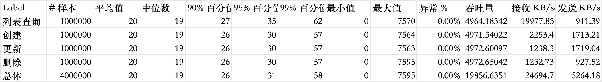

# 一个简单的交易系统雏形
## 项目介绍
基于内存的交易管理系统，支持了增、删、改和分页查询等功能；
使用docker容器化部署后，使用jmeter进行了压测


## 技术栈
* docker 容器化部署
* jdk 21，Eclipse Temurin，在Ubuntu 22.04 LTS (Jammy Jellyfish) 操作系统上搭建
* SpringBoot 3.4.3


## 其他依赖
lombok 减少set get 方法的冗长代码

## 快捷部署
* 使用docker容器化部署
```
sh build.sh
sh run.sh
```
## 压测情况
### 压测环境及参数介绍
在本地使用 docker desktop ，配置4核CPU,8G内存
压测工具 使用 Jmeter

### 压测结果
500线程并发、每个线程执行2000个请求 顺序添加、随机删除修改，翻页查询 混合压测
Label	# 样本	平均值	中位数	90% 百分位	95% 百分位	99% 百分位	最小值	最大值	异常 %	吞吐量	接收 KB/sec	发送 KB/sec
列表查询	1000000	20	19	27	35	62	0	7570	0.00%	4964.18342	19977.83	911.39
创建	1000000	20	19	26	30	57	0	7564	0.00%	4971.34022	2253.4	1713.21
更新	1000000	20	19	26	30	57	0	7563	0.00%	4972.60097	1238.3	1719.04
删除	1000000	20	19	26	30	57	0	7595	0.00%	4972.65042	1232.73	927.52
总体	4000000	20	19	26	31	58	0	7595	0.00%	19856.63509	24694.7	5264.18

